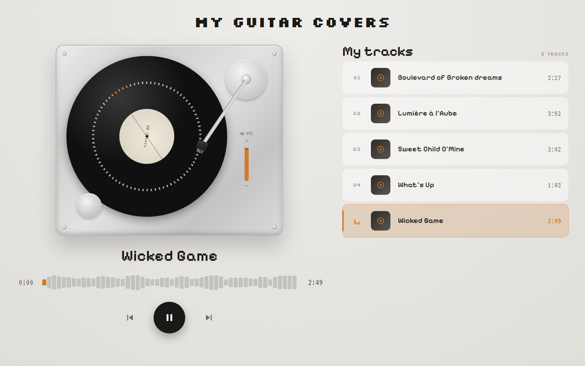
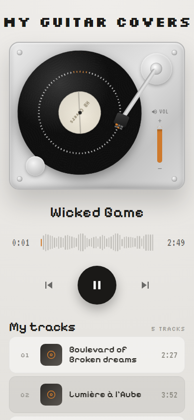

# Architecture — my-guitar-covers

## Screenshots

| Desktop | Mobile |
| --- | --- |
|  |  |

## 1. Input analysis

The `Inputs` folder contains 5 `.mp3` audio files (guitar covers), with no additional
metadata (no cover art, no description file, no provided durations):

- Boulevard of Broken Dreams.mp3
- Lumière à l'Aube.mp3
- Sweet Child O'Mine.mp3
- What's Up.mp3
- Wicked Game.mp3

### Inferred business need

A personal, single-user application (the owner of the covers) that lets them:

1. List every track for which a guitar cover exists.
2. Listen to it through a full audio player (play/pause, seek, volume, previous/next track).
3. See a spinning vinyl record animation while a track is playing.

### Persona

A single persona: the guitarist themselves, browsing their own list of covers. No
authentication, no multi-user support (not justified by the inputs).

### Use cases

- Browse the playlist.
- Select a track → it becomes the active track and starts playing.
- Control playback (play/pause, seek, volume, previous/next track).
- See the "currently playing" state visually (spinning record, animated equalizer on the
  active row, active track highlighted).

### Data handled

A track (`Track`) = an audio file + minimal metadata derived from the filename (title).
The cover's artist/author and duration are not provided: duration is read dynamically
from the audio file (the `<audio>` tag's `loadedmetadata` event), and artist/cover-art
are not displayed for lack of data (documented assumption below).

### Functional / UX constraints

- A "modern" player, close to Spotify/Apple Music: progress bar, volume control,
  previous/next track, title + elapsed/remaining time display.
- Spinning vinyl record animation only while `isPlaying === true` (pausing stops the
  rotation without resetting its position, for a natural effect).
- Playlist showing every track from the `Inputs` folder.
- Responsive layout: a two-column desktop view (turntable on the left, playlist on the
  right) collapses to a single, stacked column (turntable above, playlist below) on
  narrow/mobile screens.

### Assumptions made (missing information)

| Missing information      | Assumption                                                                          | Convention applied                  |
| ------------------------- | ------------------------------------------------------------------------------------ | ------------------------------------- |
| Cover artist / author     | Not displayed (a single guitarist, the covers are self-attributed)                  | Personal single-user app convention  |
| Track duration             | Read dynamically via `HTMLAudioElement.duration`                                     | Standard web player behavior         |
| Album artwork              | No artwork provided → a generic icon is used as the cover thumbnail                 | Convention for players without artwork |
| Playlist order              | Alphabetical order of the files                                                      | File listing convention              |
| Authentication              | None (local, single-user app)                                                       | Out of scope for the inputs          |

## 2. Tech stack

- React 18 (strict TypeScript) + Vite + pnpm
- react-router-dom (a single main route `/`, designed to be extensible to a track-detail page)
- MUI (Material UI) as the design system — light "turntable" theme (amber accent
  `#cf7a2c`, warm background `#e9e7e3`), Google Fonts Pixelify Sans / Silkscreen / VT323
  (see `src/theme/fonts.ts`)
- ESLint + Prettier + cspell
- Jest + React Testing Library
- Playwright — used ad hoc to drive the running app and take screenshots when verifying UI changes (not part of the automated test suite)

## 3. Application breakdown

### Pages

- `pages/home` — Single page: header + responsive grid (turntable player on the left,
  track list on the right on desktop; stacked into a single column on narrow screens).
  The need does not justify more than one page.

### Contexts

- `contexts/PlayerContext` — Global audio player state (active track, playing state,
  progress, volume, queue, previous/next navigation). Centralized in a context because
  it's consumed both by the track list (selection) and by the player (controls), two UI
  areas that aren't directly related in the component tree.

### Components (each: `.tsx` + `.test.tsx` + `hooks/useX.ts` when it has its own logic)

- `TurntablePlayer` — Decorative turntable (spinning record, tonearm, screws, power
  switch and start button, all purely decorative); embeds `VerticalVolumeSlider`.
- `VerticalVolumeSlider` — Interactive vertical volume slider (pointer drag + arrow
  keys), with a live orange fill showing the current level.
- `NowPlaying` — Current track title, `Waveform` and transport controls (previous/
  play-pause/next).
- `Waveform` — Waveform-shaped progress/seek bar (52 bars), replaces the former
  `ProgressBar`; shows a lighter color preview of the seek target on hover.
- `TrackList` — Track list (container) + "My tracks" header.
- `TrackRow` — A single playlist row (track number or `EqualizerBars`, generic cover
  thumbnail, title, duration); has a hover background distinct from the active state.
- `EqualizerBars` — 3-bar equalizer animation shown on the active, playing row.

### Hooks

- `hooks/useAudioPlayer` — Wraps the native `<audio>` element (play/pause/seek/volume/
  events), kept isolated from the Context so it stays testable independently of the
  React DOM.
- `hooks/useTrackDurations` — Preloads metadata (duration) for every track via
  short-lived `Audio` instances (`preload="metadata"`), so the list can display every
  track's duration without waiting for it to be played.

### Utils

- `utils/tracks.ts` — Source of the tracks (derived from the files in `public/audio`)
  and id/title generation from the filename.
- `utils/format.ts` — Duration formatting (`mm:ss`).

### TypeScript data model

```ts
interface Track {
  id: string
  title: string
  src: string // path to the audio file in /public/audio
}

interface PlayerState {
  currentTrackId: string | null
  isPlaying: boolean
  currentTime: number
  duration: number
  volume: number
}
```

## 4. Responsive layout

The home page uses a CSS grid that switches at the MUI `md` breakpoint (900px):

- **Desktop (≥ 900px)**: two columns — turntable + now-playing on the left, track list
  on the right. The turntable's width is computed with `min(560px, 100%, calc((100vh -
  400px) * 560 / 470))` so it shrinks to fit both the available column width and the
  viewport height, keeping the transport controls visible without scrolling.
- **Mobile (< 900px)**: a single, centered column (max 430px wide) — turntable and
  now-playing on top, track list below, matching the dedicated mobile design.

## 5. Tests

Every component, hook and util has its own coverage (rendering, interactions, edge
cases: volume at 0/1, no track selected, end of track → next track, hover/keyboard
interactions on the waveform and volume slider).
