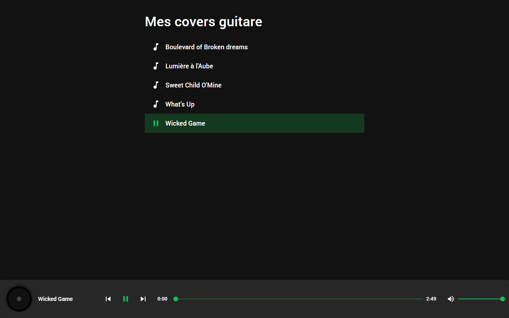

# My Guitar Covers

A minimal, Spotify-style web player for browsing and listening to a personal collection of guitar cover recordings.



## Features

- 🎸 Playlist of guitar covers, listed in alphabetical order
- ▶️ Full playback controls — play/pause, seek, previous/next track
- 🔊 Volume control
- 💿 Spinning vinyl disc animation that runs while a track is playing
- ⏱️ Live progress bar with elapsed/remaining time, duration read directly from the audio file
- 🖍️ Active/playing track highlighted in the list

## Tech Stack

- [React 18](https://react.dev/) + TypeScript (strict)
- [Vite](https://vite.dev/) — dev server & build tool
- [pnpm](https://pnpm.io/) — package manager
- [React Router](https://reactrouter.com/) — routing
- [MUI (Material UI)](https://mui.com/) — design system
- [Jest](https://jestjs.io/) + [React Testing Library](https://testing-library.com/) — testing
- ESLint, Prettier, cspell — linting, formatting, spell-checking

## Getting Started

### Prerequisites

- [Node.js](https://nodejs.org/) (LTS recommended)
- [pnpm](https://pnpm.io/installation)

### Installation

```bash
pnpm install
```

### Development

```bash
pnpm dev
```

The app will be available at `http://localhost:5173`.

### Build

```bash
pnpm build
```

### Preview the production build

```bash
pnpm preview
```

## Available Scripts

| Script               | Description                              |
| -------------------- | ----------------------------------------- |
| `pnpm dev`           | Start the Vite dev server                |
| `pnpm build`         | Type-check and build for production      |
| `pnpm preview`       | Preview the production build locally     |
| `pnpm test`          | Run the test suite once                  |
| `pnpm test:watch`    | Run the test suite in watch mode         |
| `pnpm lint`          | Lint the codebase with ESLint            |
| `pnpm format`        | Format the codebase with Prettier        |
| `pnpm format:check`  | Check formatting without writing changes |
| `pnpm spell`         | Spell-check source files with cspell     |

## Project Structure

```
public/audio/        Audio files (.mp3) for each cover
src/
  components/         UI components (TrackList, TrackItem, PlayerBar, VinylDisc, ProgressBar, VolumeControl)
  contexts/           PlayerContext — global audio player state
  hooks/              useAudioPlayer — wraps the native <audio> element
  pages/home/         Home page (playlist + player)
  types/              Shared TypeScript types (Track)
  utils/              Track listing and time formatting helpers
```

Each component is colocated with its test file (`*.test.tsx`) and, where relevant, its own hook (`hooks/useX.ts`).

See [ARCHITECTURE.md](ARCHITECTURE.md) for the full design rationale, data model, and assumptions made when building the app.

## Adding a New Cover

1. Drop the `.mp3` file into `public/audio/`.
2. Add its filename to the `AUDIO_FILENAMES` list in [src/utils/tracks.ts](src/utils/tracks.ts).

The title and track id are derived automatically from the filename; duration is read dynamically from the audio file at playback time.

## License

This is a personal project. No license has been chosen yet — all rights reserved by default.
