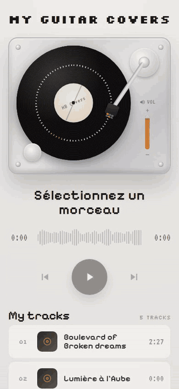

# My Guitar Covers

A personal web player for browsing and listening to guitar cover recordings, styled as a retro turntable.

**Live demo:** [hb-covers.vercel.app](https://hb-covers.vercel.app/)

## Screenshots

| Desktop | Mobile |
| --- | --- |
|  |  |

## Features

- 🎸 Playlist of guitar covers, listed in alphabetical order
- 💿 Decorative turntable with a spinning vinyl record, tonearm and power switch, driven by the actual playback state
- ▶️ Full playback controls — play/pause, seek, previous/next track
- 🔊 Interactive vertical volume slider with a live orange fill showing the current level
- ⏱️ Waveform-style progress bar with elapsed/remaining time and a hover preview of the seek target, duration read directly from each audio file
- 🟧 Active/playing track highlighted in the list, with an animated equalizer indicator
- 🖱️ Hover states on track rows, the progress bar and the play button
- 📱 Responsive layout — two-column desktop view (turntable + playlist side by side), single-column stacked view on narrow/mobile screens

## Tech Stack

- [React 18](https://react.dev/) + TypeScript (strict)
- [Vite](https://vite.dev/) — dev server & build tool
- [pnpm](https://pnpm.io/) — package manager
- [React Router](https://reactrouter.com/) — routing
- [MUI (Material UI)](https://mui.com/) — design system, themed with a light "turntable" palette (amber accent, warm gray background) and Google Fonts (Pixelify Sans, Silkscreen, VT323)
- [Cloudinary](https://cloudinary.com/) — hosts the audio files (`.mp3`), served directly from Cloudinary's CDN instead of `public/audio/`
- [Vercel](https://vercel.com/) — hosting/deployment (auto-detected Vite static build)
- [Jest](https://jestjs.io/) + [React Testing Library](https://testing-library.com/) — testing
- [Playwright](https://playwright.dev/) — manual/visual verification of the running app
- ESLint, Prettier, cspell — linting, formatting, spell-checking

## Getting Started

### Prerequisites

- [Node.js](https://nodejs.org/) (LTS recommended)
- [pnpm](https://pnpm.io/installation)

### Installation

```bash
pnpm install
```

### Development

```bash
pnpm dev
```

The app will be available at `http://localhost:5173`.

### Build

```bash
pnpm build
```

### Preview the production build

```bash
pnpm preview
```

## Available Scripts

| Script               | Description                              |
| -------------------- | ----------------------------------------- |
| `pnpm dev`           | Start the Vite dev server                |
| `pnpm build`         | Type-check and build for production      |
| `pnpm preview`       | Preview the production build locally     |
| `pnpm test`          | Run the test suite once                  |
| `pnpm test:watch`    | Run the test suite in watch mode         |
| `pnpm lint`          | Lint the codebase with ESLint            |
| `pnpm format`        | Format the codebase with Prettier        |
| `pnpm format:check`  | Check formatting without writing changes |
| `pnpm spell`         | Spell-check source files with cspell     |

## Project Structure

```
src/
  components/
    TurntablePlayer/    Decorative turntable (spinning record, tonearm, power switch); embeds VerticalVolumeSlider
    VerticalVolumeSlider/  Interactive vertical volume control
    NowPlaying/         Current track title, Waveform and transport controls
    Waveform/           Waveform-style seek bar
    TrackList/          Playlist container + "My tracks" header
    TrackRow/           A single playlist row (number/EqualizerBars, cover thumb, title, duration)
    EqualizerBars/      Animated equalizer shown on the active, playing row
  contexts/PlayerContext   Global audio player state
  hooks/
    useAudioPlayer        Wraps the native <audio> element
    useTrackDurations     Preloads metadata to know every track's duration up front
  pages/home/           Home page (header + responsive turntable/playlist layout)
  theme/fonts.ts         Shared font-family constants
  types/                 Shared TypeScript types (Track)
  utils/                 Track listing and time formatting helpers
```

Each component is colocated with its test file (`*.test.tsx`) and, where relevant, its own hook (`hooks/useX.ts`).

See [ARCHITECTURE.md](ARCHITECTURE.md) for the full design rationale, data model, and assumptions made when building the app.

## Adding a New Cover

1. Upload the `.mp3` file to the Cloudinary account (resource type `video`, used for all audio/video uploads).
2. Add its filename to the `AUDIO_FILENAMES` list and its Cloudinary `public_id` to `CLOUDINARY_PUBLIC_IDS` in [src/utils/tracks.ts](src/utils/tracks.ts).

The title and track id are derived automatically from the filename; duration is read dynamically from the audio file. Audio is streamed straight from Cloudinary's CDN — no audio files are committed to this repo.

## Deployment

The app is deployed on [Vercel](https://vercel.com/) as a static Vite build (framework auto-detected, no extra config needed). Every push to `master` triggers a new deployment.

**Live app:** https://hb-covers.vercel.app/

## License

This is a personal project. No license has been chosen yet — all rights reserved by default.
